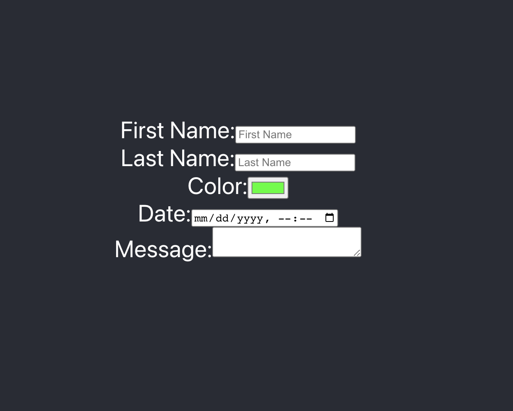

# Form Practice - React.js App
Building a React app with onchange functionality for an HTML form for BocaCode C-10 in class practice.



## Demo Link
[See Link](https://form-practice-jsohndata.web.app/)

## Covered In Class
* onChange
* Form Elements
* Controlled Components

## Basic Code
```
<label>First Name:
<input type="text">
</label>
```